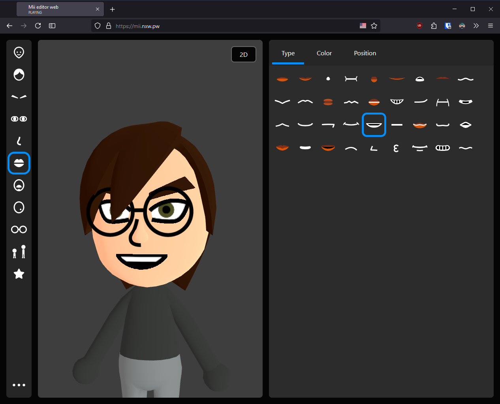

# Mii Maker app in TypeScript

Create and share Miis online with just a few clicks!

**(Note: Some of the icons in the app are currently placeholders until I can get the Mii Studio icons used)**

## Credits

- A version of the [mii-unsecure.ariankordi.net](https://mii-unsecure.ariankordi.net) API by [ariankordi](https://github.com/ariankordi), used to generate 3D Mii heads and renders.
- `mii-js` library used for interacting with Mii data in a JavaScript-friendly way
- [Some code](https://github.com/datkat21/mii-maker-real/tree/master/src/external/mii-frontend) "borrowed" from arian's website.

## Features

This uses the FFSD (3DS/Wii U) data type, so the extra colors and parts from the Nintendo Switch aren't available.

- [x] Change parts and colors of the Mii
- [x] Save and load Miis in your library
- [x] Export Mii to QR code/FFSD format

## Contributing

I'm open to contributions if you want to help on the project!
